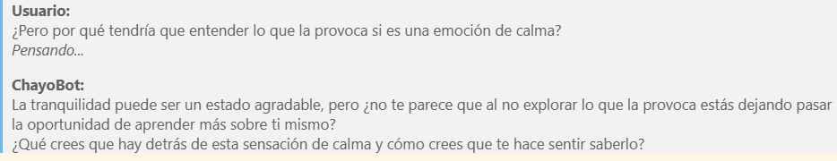

# Socratic Mental Health Chatbot (RAG + Llama 3)


Este repositorio contiene la implementación de un **Chatbot Socrático** diseñado para brindar acompañamiento en temas de salud mental. A diferencia de los asistentes convencionales, este sistema no da consejos directos, sino que utiliza el **Método Socrático** para formular preguntas reflexivas que ayuden al usuario a encontrar sus propias respuestas.

El proyecto utiliza una arquitectura **RAG (Retrieval-Augmented Generation)** para anclar las respuestas del modelo generativo a consejos terapéuticos reales, minimizando alucinaciones.



## Tecnologías Utilizadas

* **Python 3.10+**
* **ChromaDB**: Base de datos vectorial para el almacenamiento y recuperación de embeddings.
* **Ollama (Llama 3)**: LLM local utilizado para la generación de respuestas socráticas.
* **Sentence-Transformers (`all-MiniLM-L6-v2`)**: Modelo para generar embeddings semánticos.
* **Deep Translator**: Para soporte multilingüe (Español/Inglés/Francés).

## Estructura del Proyecto

* `chatbot_dialogos.ipynb`: Notebook principal con el pipeline ETL, vectorización y chat.
* `requirements.txt`: Librerías necesarias para ejecutar el proyecto.
* `images/`: Evidencias gráficas del funcionamiento.

## Instalación y Uso

1.  **Clonar el repositorio:**
    ```bash
    git clone [https://github.com/TU_USUARIO/socratic-chatbot.git](https://github.com/TU_USUARIO/socratic-chatbot.git)
    cd socratic-chatbot
    ```

2.  **Instalar dependencias:**
    ```bash
    pip install -r requirements.txt
    ```

3.  **Configurar Ollama:**
    Asegúrate de tener [Ollama](https://ollama.com/) instalado y el modelo Llama 3 descargado:
    ```bash
    ollama pull llama3
    ```

4.  **Dataset:**
    Descarga el dataset original (ver sección de Créditos) y colócalo en la raíz del proyecto con el nombre `mental_health_dialogos.csv`.

5.  **Ejecutar:**
    Abre el notebook `chatbot_dialogos.ipynb` y ejecuta las celdas en orden.

## Metodología

El sistema sigue un flujo de **Recuperación Aumentada (RAG)**:

1.  **Input:** El usuario ingresa texto en su idioma nativo.
2.  **Traducción:** Se normaliza el texto al inglés.
3.  **Retrieval:** ChromaDB busca en el corpus el consejo terapéutico más similar semánticamente.
4.  **Augmentation:** Se construye un prompt inyectando el consejo recuperado y el historial del chat.
5.  **Generation:** Llama 3 genera una respuesta reflexiva (socrática) basada en el consejo.

### Análisis de Datos
Se realizó un análisis de la longitud de tokens del corpus para asegurar la compatibilidad con el modelo de embeddings:


## Créditos y Dataset

Este proyecto fue desarrollado con fines académicos.

**Dataset Utilizado:**
El corpus de conocimiento terapéutico no es propiedad de este repositorio. Fue obtenido de fuentes públicas:
* **Nombre:** Mental Health Counseling Conversations
* **Fuente Original:**  [Amod/mental_health_counseling_conversations](https://huggingface.co/datasets/Amod/mental_health_counseling_conversations)
* **Atribución:** Agradecimientos a los creadores del dataset original por hacer disponible esta información para la investigación.

## 👤 Autor

**I. Rafael Salgado F.**
* Estudiante de Ingeniería en Inteligencia Artificial.

---
*Disclaimer: Este chatbot es una herramienta experimental y académica. No sustituye la ayuda profesional psicológica.*
